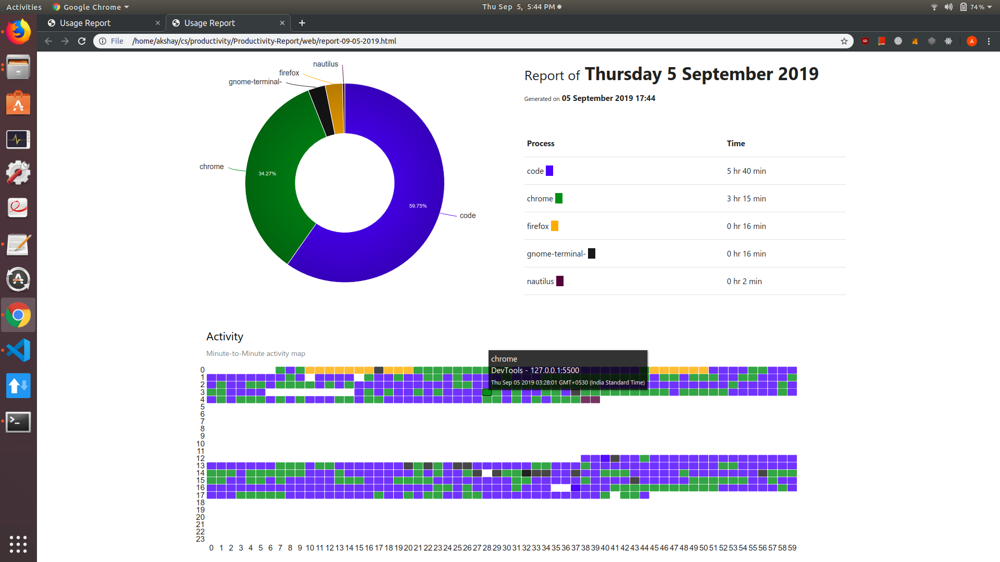
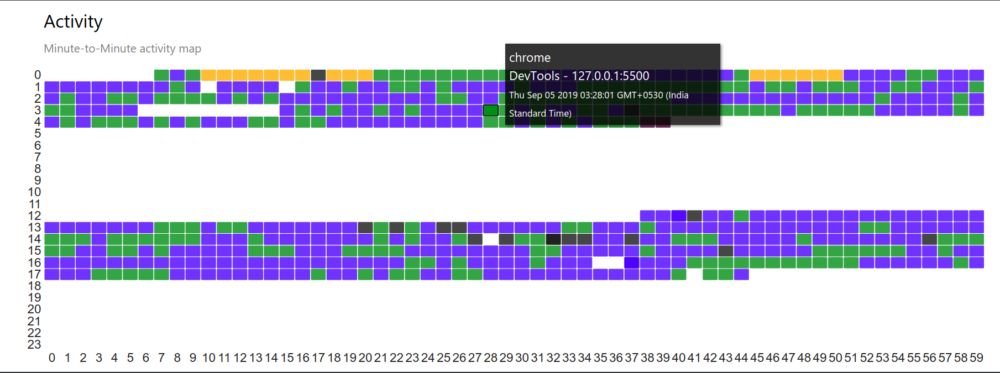
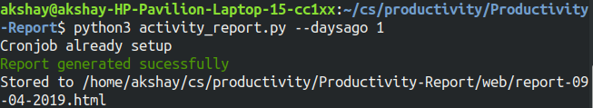
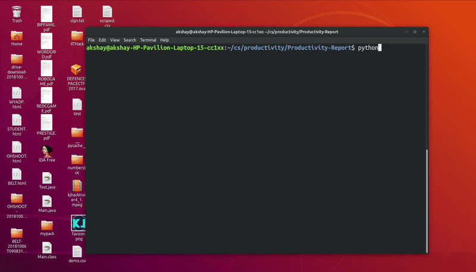
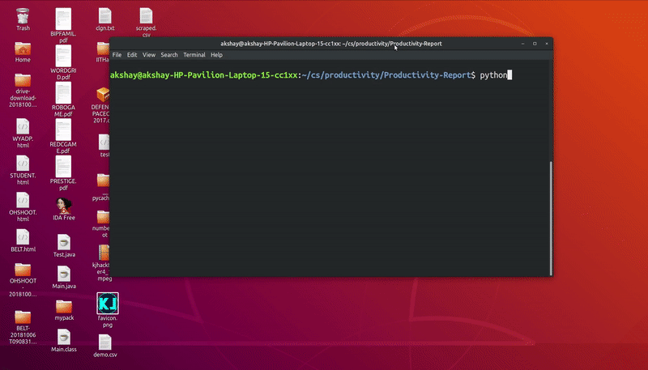

<h1 align="center">Activity Outline</h1>

<h2>📈📊⌚</h2>

 

 

------------------------------------------
>  We all want our days to be productive, but it's often difficult to keep a track of how we spend our time. So here's something that kept me busy indoors on a rainy day :)

> This project records a user's entire activity on their laptop or desktop, maintains an **automatic minute-by-minute log**, and can summarise it in neat charts so that it is easier to recall, analyse ( and regret ) the way we spend our time.

> A cron job runs every minute to record the the window that is in focus and the user is interacting with. The main application uses this info to summarise the entire day. Reports of previous days can be accessed using the **--daysago** parameter

##### Demo 

  

  

  

  

------------------------------------------

### Possible improvements
- [ ] Add support for OS X, Windows. ( **This project currently only supports Linux and OS X <= 10.7**)
- [ ] Classify applications 
- [ ] Sync for multiple devices.
- [ ] Get report of a specific date in the past

------------------------------------------
### Contributing
 This repo is open to `enhancements` & `bug-fixes` :smile: 

### Note

 This project was done in my free time under `6 hours with no pre-preparation`

------------------------------------------
### Contributors

- [@akshay-99](https://github.com/akshay-99)

------------------------------------------

Made with &hearts; by <a href="https://github.com/akshay-99" target="_blank">akshay-99</a>

